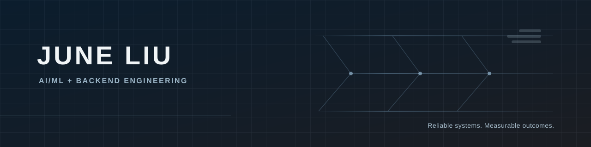

# Hi, I'm June Liu

M.S. in Computer Science at Northeastern University, building reliable AI applications and scalable backend systems.

## Featured Project

### [QueryGuard — Safe Text-to-SQL](https://github.com/jliu4950/queryguard)

 [Repository](https://github.com/jliu4950/queryguard)

An evaluation-driven Text-to-SQL service for fictional ecommerce data that validates read-only SQL and enforces server-side authorization.

- Schema retrieval before SQL generation
- AST-based SQL safety validation
- Server-enforced sales-rep row-level authorization
- 25 versioned evaluation cases, tested in CI on Python 3.9 and 3.13

## What I Work On

- **AI systems:** LLM applications, retrieval, evaluation, and safety guardrails
- **Backend systems:** APIs, data modeling, event-driven services, caching, and observability

## Connect

[LinkedIn](https://www.linkedin.com/in/juneliu4950)
